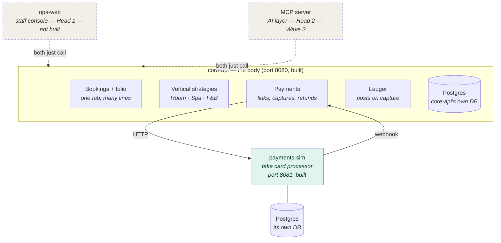
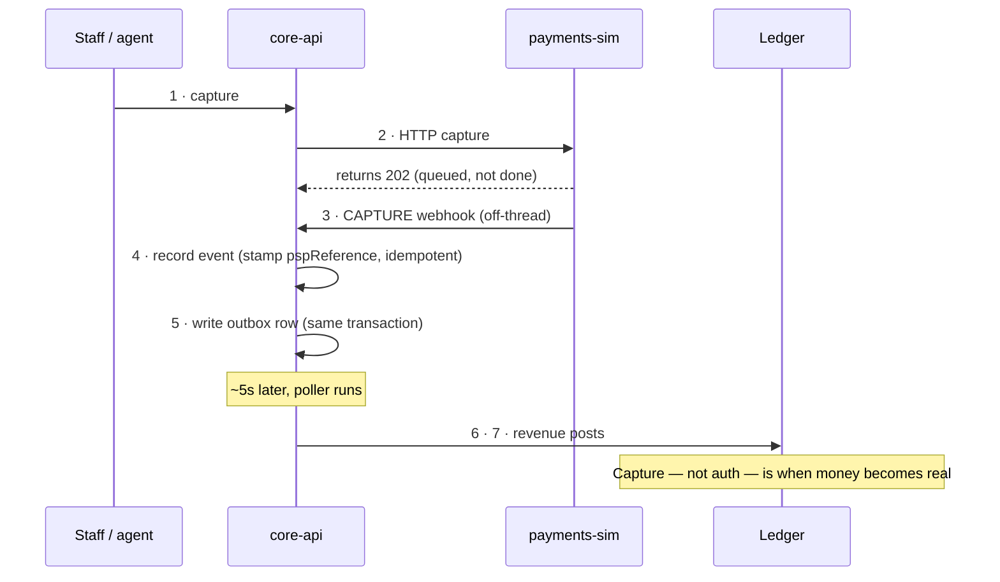

# Start Here

> **Who this is for:** a developer (or agent) about to do work on `hotel-sim` who wants the
> lay of the land in three minutes — *not* the full design spec, *not* the run book.
>
> Two longer docs sit underneath this one. Read them when you need them, not before:
> - **[`README.md`](../README.md)** — the thesis, the architecture, the intended end-state.
> - **[`docs/RUNNING.md`](RUNNING.md)** — every way to run it, every endpoint, every `curl`.
>
> This page is the map that tells you which of those to open, and where the work is.

---

## What this project is, in one breath

A pretend hotel that sells four kinds of thing — **rooms, spa treatments, restaurant tables,
and events** — all through one system. It takes bookings, takes payments through a fake
card processor, and keeps a proper financial ledger.

It's built to prove one specific point: *a normal, complete operations system can later have
an AI (MCP) layer bolted on top without rebuilding anything underneath.* Everything is built
so that bolt-on stays easy. You don't need to care about the AI layer to work on the system —
it isn't built yet. You just need to know **why the rules are strict**: every capability has
to be usable by a plain web console first, so nothing is ever built "just for the agent."

---

## The four moving parts

There are only two programs that run, plus their two databases. Everything else is planned.

| Part | What it is | Runs on | Built? |
|---|---|---|---|
| **`core-api`** | The whole brain. All the booking rules, pricing, payments, and the ledger live here. | `:8080` | ✅ Yes — this is most of the codebase |
| **`payments-sim`** | A fake card processor. Mints transaction references, hosts a "checkout," fires webhooks back. Deliberately a *separate* program so the two talk over real HTTP. | `:8081` | ✅ Yes |
| **`ops-web`** | The staff console (a website). The "head" a human uses. | — | ❌ Not started |
| **MCP server** | The AI layer. The whole reason the project exists, but the *last* thing built. | — | ❌ Not started (Wave 2) |

Each program has its own Postgres database. They never share tables.

When you read "two heads on one body": the **body** is `core-api`, and the two **heads**
(the web console and the AI layer) are both just thin clients of it. Neither exists yet, and
that's fine — the body is what's real.

> Dashed = planned, not built. Solid = live today. The two heads are both thin clients —
> nothing in the body exists "for the agent"; the console would use the exact same endpoints.

---

## What actually works today

Three of the four verticals are fully live: **Rooms, Spa, and Food & Beverage**. You can
check availability, book them, pay for them, and watch the money land in the ledger.

The full money story works end-to-end: send a payment link → "pay" on the fake processor →
a webhook comes back → `core-api` records it → revenue posts to the ledger **when the card is
captured, not when it's authorised**. Refunds, cancellations, and partial payments all work.
There are two finance reports: revenue split by vertical, and a list of who still owes money.

**What's *not* built yet** (the actual frontier — pick your next job from here):
- **Events** — the fourth vertical. The database table and the `EVENT` type exist, but there's
  no *strategy* class, so events can't be priced or booked yet. This is the small, well-shaped
  next job — it copies the Spa/F&B pattern.
- **`ops-web`** — the staff console. The big one; it's the real proof of the thesis.
- **The MCP / AI layer** — the endgame, Wave 2.
- **`pay-web`** — a nicer customer-facing checkout page. Deferred on purpose.

---

## The one rule that explains all the others

**No code gets written until there's a frozen contract for it.**

A "contract" is just a written-down, signed-off agreement about what an endpoint, table, or
rule does — each one has a stable ID like `API-016` or `SCH-022`. Once frozen, it doesn't
change; if something needs to change, you write a small *refactor record* (`RX-001`, `RX-002`…)
that points at what it supersedes. Nothing is ever quietly edited.

This sounds bureaucratic for a hobby project, and it kind of is — but it's the entire point.
The discipline *is* the thesis: it proves the system was designed deliberately, not patched
into shape. So:

- **The single source of truth for "is this contract frozen?"** is one table: the
  **Freeze Ledger** in [`contracts/WAVE0_00_OVERVIEW.md`](../contracts/WAVE0_00_OVERVIEW.md) §1b.
  If any other file disagrees with that table, the table wins and the other file is the bug.
- **You don't freeze things. Desk does.** (Desk is the one person who arbitrates contract
  changes.) You draft; Desk freezes. If you spot a mismatch against a frozen contract, you
  **flag it — you never quietly fix it.**
- **Every new ability needs an HTTP path in the same slice.** A capability that only exists in
  the service layer with no way to call it over HTTP is an incomplete slice (learned the hard
  way).

---

## Where everything lives

| You want to… | Go to |
|---|---|
| Run it locally | [`docs/RUNNING.md`](RUNNING.md) |
| Understand the full design & the "why" | [`README.md`](../README.md) |
| Check if a contract is frozen | [`contracts/WAVE0_00_OVERVIEW.md`](../contracts/WAVE0_00_OVERVIEW.md) §1b (the Freeze Ledger) |
| See the API contracts (endpoints/DTOs) | [`contracts/WAVE0_02_OPENAPI.yaml`](../contracts/WAVE0_02_OPENAPI.yaml) |
| See the database schema & allowed values | [`contracts/WAVE0_01_SCHEMA.sql`](../contracts/WAVE0_01_SCHEMA.sql) |
| Understand the payment/webhook handshake | [`docs/payments-flow.md`](payments-flow.md) + [`contracts/WAVE0_05_PSP_API.md`](../contracts/WAVE0_05_PSP_API.md) |
| Find the brain's code | `core-api/src/main/java/com/hotelops/core/` |
| Find a vertical's pricing/availability logic | `…/product/vertical/` (`RoomStrategy`, `SpaStrategy`, `FnbStrategy`) |
| Run the whole money loop as one test | [`docs/RUNNING.md`](RUNNING.md) → "The money loop (smoke harness)" |

---

## The one thing that surprises everyone: money is asynchronous

When you capture a payment, `core-api` does **not** finish the job inline. It asks
`payments-sim` to capture, gets an instant `202 Accepted` back, and that's it — *the money
isn't real yet*. The actual settlement comes moments later as a **webhook**, and revenue only
posts to the ledger a few seconds after that, when a background poller picks it up.

**Why this matters for you:** anything that checks "did revenue post?" immediately after the
`202` will fail intermittently and look like a bug. It isn't — the work simply hasn't happened
yet. This is exactly why every payment test in the Postman collection **polls** until the
terminal state instead of asserting on the response. If you're touching the payment or ledger
code, hold this picture in your head.

---

## A few words you'll see everywhere

- **Vertical** — one of the four sellable things: `ROOM`, `SPA`, `FNB`, `EVENT`.
- **Folio** — a customer's running tab. One booking, possibly spanning several verticals
  (a room + a massage + dinner), all on one bill.
- **Strategy** — the per-vertical class that knows how that vertical prices and checks
  availability. New verticals are mostly "write a new strategy."
- **Capture vs. authorise** — *authorise* = hold money on a card (not revenue yet). *Capture*
  = actually take it (this is when revenue posts). Rooms hold and capture later; F&B does both
  at once.
- **Money is always in minor units** (pence), stored as whole numbers. Never floats. £180 is
  `18000`.
- **`shopperReference` / `merchantReference` / `pspReference`** — three different ID types in
  the payment world. Customer identity, our per-attempt reference, and the processor's own
  transaction id, respectively. [`README.md`](../README.md) "Finance" explains the taxonomy.