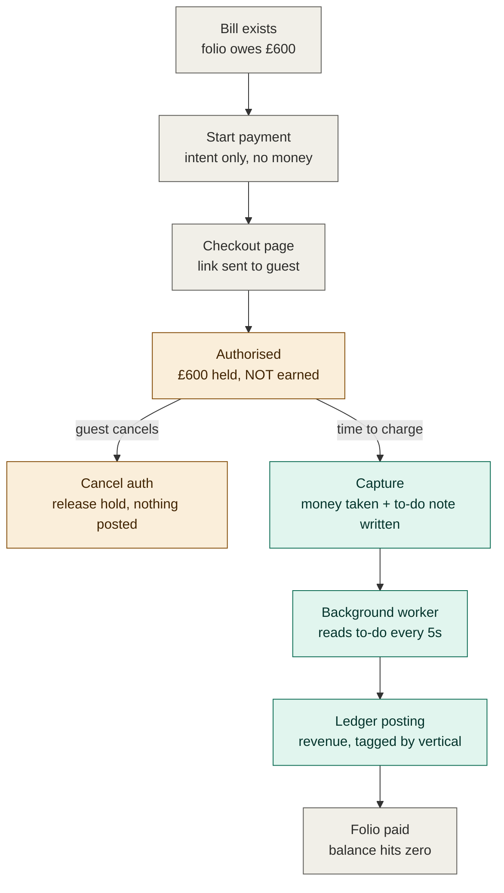
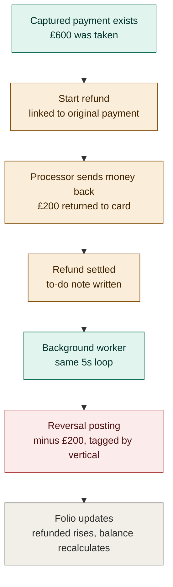
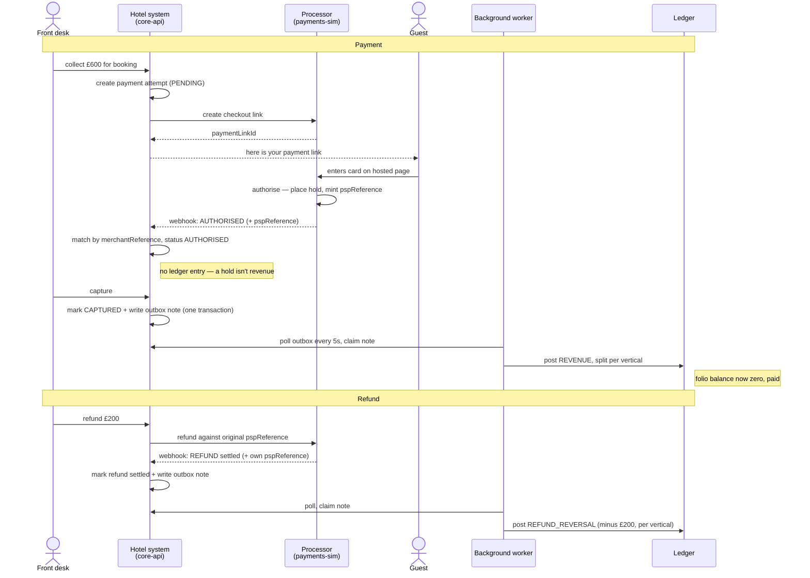

# Payment & refund flows

How money moves through `core-api`, from a payment being created through to a
ledger posting — and the mirror-image path for refunds.

> **What's live today vs. designed:** everything from **capture** rightward (the
> outbox note, the background worker, the ledger postings) is built and runnable.
> Everything left of capture — starting a payment, the checkout link, the guest
> paying, the authorisation webhook — depends on `payments-sim`, which is currently
> an empty shell with no payment controller wired. So the **right half of each
> diagram is live; the left half is designed but not yet executable.**

---

## The one rule that explains everything

**Putting a hold on a card is not the same as earning money.** Reserving £600
against a card is a promise. Money is only *earned* — written into the ledger —
when you actually **capture** it. This single rule explains why the flow splits
where it does and why cancelling an authorisation reverses nothing.

---

## Payment flow

Colours mark the money-state: grey = no money moved, amber = held but not earned,
green = taken / recorded.

The path **splits at authorisation**. The left branch (cancel) touches nothing in
the ledger because nothing was ever posted — the payoff of "a hold isn't revenue."
The right branch is the only way money becomes earnings, and even then capture
doesn't write the ledger directly: it drops a note that the background worker
picks up.

---

## Refund flow

Same colour language, plus red for the reversal.

A refund reuses the **exact same back half** as a payment — the to-do note and the
background worker are shared machinery. The only real differences: a refund must be
linked to an original *captured* payment (you can't refund a hold), and the posting
it produces is negative.

---

## Sequence view — who talks to whom over time

The same two flows from the angle of the four parties passing messages.

Three things the sequence view makes obvious:

- **Every confirmation is a webhook** (the dashed return arrows). The processor is
  never called synchronously and trusted to answer inline — real PSPs are
  asynchronous, so the system is built to *receive* "it happened" messages.
- **The background worker is never in the critical path** of taking money. Staff
  trigger capture, the system commits, and only later does the worker independently
  move money into the ledger. That horizontal gap between "mark CAPTURED" and "post
  REVENUE" is the decoupling, drawn as time.
- **Both flows converge on one worker and one ledger.** Capture and refund aren't
  two pipelines; they're two kinds of note in one to-do list, drained by one worker.

---

## Reference: the four payment identifiers

| Reference | Who mints it | When | What it names |
|-----------|--------------|------|---------------|
| `shopperReference` | Hotel system | Customer created | The customer, permanently (one per human) |
| `merchantReference` | Hotel system | Per payment attempt | One payment attempt — the reconciliation anchor |
| `pspReference` | Processor | At authorisation | The processor's own id for the transaction |
| `paymentLinkId` | Processor | When link requested | The hosted checkout page |

Two are yours (you send them out), two are the processor's (you store what comes
back). Reconciliation is keeping your `merchantReference` and their `pspReference`
glued to the same row.
